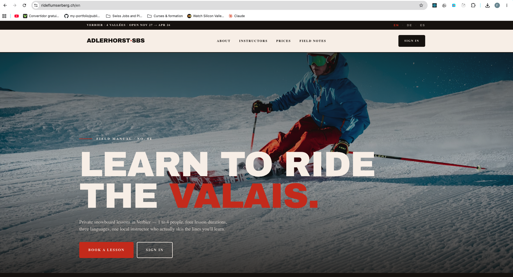
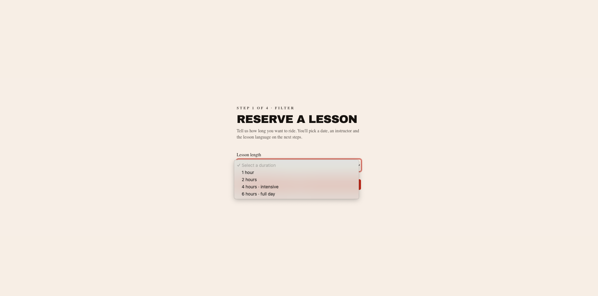
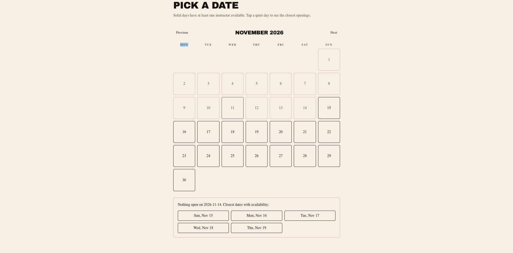
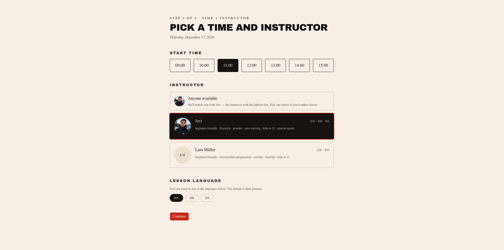
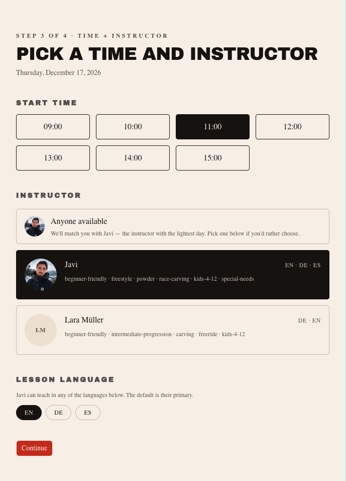
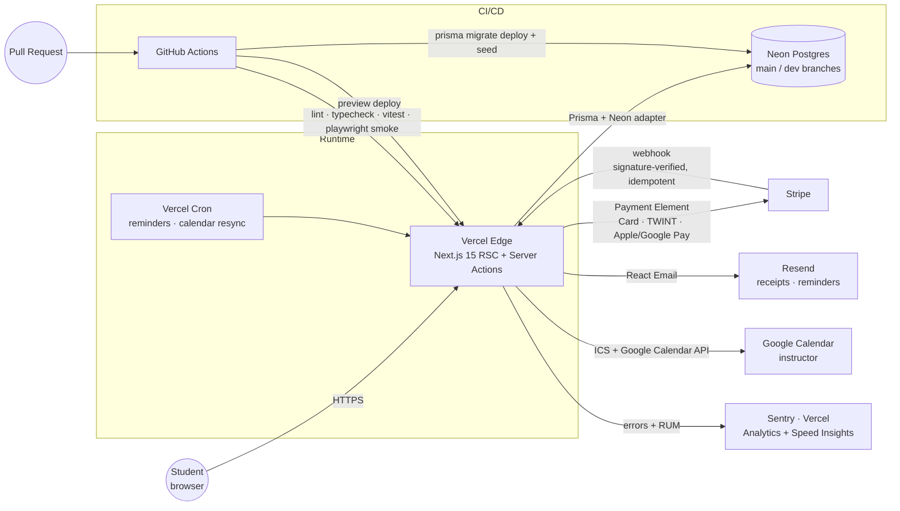

# Snowboard Booking Platform

> An **AI-first**, production-grade booking system for a snowboard school in the Swiss Alps (Flumserberg). Built end-to-end by one developer + Claude Code, architected for multi-instructor expansion.

[](https://nextjs.org)
[](https://react.dev)
[](https://www.typescriptlang.org)
[](https://tailwindcss.com)
[](https://www.prisma.io)
[](https://www.better-auth.com)
[](https://stripe.com)
[](https://neon.tech)
[](https://vercel.com)
[](https://sentry.io)
[](https://docs.anthropic.com/en/docs/claude-code)
[](https://rideflumserberg.ch)
[](LICENSE)

**[Live Demo →](https://rideflumserberg.ch)** · **[PRD](docs/PRD.md)** · **[Architecture](docs/Architecture.md)** · **[Workflow](docs/WORKFLOW.md)** · **[Backlog](docs/FEATURES.md)**



---

## Why This Project

A real product I'm shipping for **a snowboard school in Flumserberg, Switzerland**. It also doubles as the canonical example of how I build software in 2026 — **AI-first**, with strict conventions, explicit agents, and a workflow that produces production code instead of prototype slop.

**The thesis:** generic booking platforms (Bókun, Peek, FareHarbor) are functional but ugly, generic, and expensive. Small independent schools deserve a premium, editorial brand and a frictionless multilingual booking flow. That's what this builds — minus the 18% commission.

---

## The Booking Flow (Steps 1 → 3)

A three-step funnel optimized for conversion: **duration → smart calendar → instructor**. Language is a per-instructor attribute revealed only at Step 3 — never a Step 1 filter (thin supply + hard filter = lost sales).

| Step 1 — Duration | Step 2 — Smart calendar | Step 3 — Anchor time + instructor |
|---|---|---|
|  |  |  |

**Mobile-first.** Every screen designed for thumb-reach and one-handed use first; desktop is the secondary canvas.

<p align="center">
  
</p>

---

## Architecture at a glance



Every dependency is intentional. See [`docs/Architecture.md`](docs/Architecture.md) for the full data model + ADRs.

---

## AI-First Development

This isn't "I used Copilot to autocomplete." This is a full agentic pipeline. Every feature follows the same loop, with a documented context surface so Claude makes the right decision the first time.

### 1. Context surface (read by Claude every session)

| File | Purpose |
|---|---|
| [`CLAUDE.md`](CLAUDE.md) | Stack rules, naming, design direction, security checklist, money handling, git ritual |
| [`docs/PRD.md`](docs/PRD.md) | Product + business: personas, KPIs, cancellation policy, monetization |
| [`docs/Architecture.md`](docs/Architecture.md) | Data model, integrations, ADRs |
| [`docs/FEATURES.md`](docs/FEATURES.md) | Living backlog. **No ticket → no work.** Source of truth for scope |
| [`docs/WORKFLOW.md`](docs/WORKFLOW.md) | Subagent orchestration: Plan → Build → Review → Test |

### 2. Feature loop

```
┌────────────┐    ┌────────────┐    ┌────────────┐    ┌────────────┐
│  A. LOCATE │ →  │  B. PLAN   │ →  │  C. BUILD  │ →  │  D. REVIEW │
│ investigtr │    │   agent    │    │   builder  │    │  + tests   │
└────────────┘    └────────────┘    └────────────┘    └────────────┘
   where is X?      step plan         1-2 files         diff + e2e
                    no edits          surgical edit     + visual
```

- **Locate** — `cavecrew-investigator` finds the code, no fixes proposed.
- **Plan** — `Plan` agent designs the implementation. Does not edit.
- **Build** — `cavecrew-builder` or main thread. Strict scope from the ticket.
- **Review** — `cavecrew-reviewer` for the diff, `playwright-skill` for E2E + visual, `impeccable` for UI, `security-review` before merging `main`.

### 3. Skills active on this repo

| Skill | Role |
|---|---|
| `impeccable` | Editorial UI direction (Aesop, Cereal, Monocle references) |
| `playwright-skill` | E2E + visual review loop |
| `vercel-react-best-practices` | React/Next.js perf base |
| `nextjs-app-router-patterns` | RSC, streaming, Server Actions |
| `mastering-typescript` | strict-mode TS, generics, mapped types |
| `prisma-database-setup` · `prisma-client-api` · `prisma-postgres` | Prisma + Neon end-to-end |
| `next-intl-add-language` | Locale + slug translation maintenance |
| `shadcn` | shadcn/ui composition, theming, CLI |
| `stripe-best-practices` · `upgrade-stripe` | Payment integration patterns + key hygiene |
| `playwright-core` · `webapp-testing` · `booking-platform-perf` | QA + Web Vitals budgets |
| `worktrees` | Per-ticket worktree lifecycle + env seeding |

### 4. Hard rules baked into `CLAUDE.md`

- **No stack substitutions** — Better Auth (not NextAuth), Prisma (not Drizzle), Resend (not SendGrid).
- **Server Components by default.** `'use client'` only when truly needed.
- **All multi-table mutations inside Prisma transactions.**
- **Money:** stored as `priceInCents: Int`. Currency math on the server. Always.
- **Worktree per ticket** (`../booking-platform.f-XXX`), descriptive commits with `Qué / Por qué / Cómo verificar / Refs` body, push + PR before `done`.

---

## Tech Stack

| Layer | Tech | Why |
|---|---|---|
| Framework | **Next.js 15** (App Router, RSC, Server Actions) | RSC ships less JS, Server Actions kill API boilerplate |
| Runtime | **React 19** + **Turbopack** | Latest concurrent rendering + fastest dev loop |
| Language | **TypeScript** (`strict`, `noUncheckedIndexedAccess`) | Compile-time guarantees on a booking domain that loves edge cases |
| Styling | **Tailwind v4** + **shadcn/ui** (heavily modified) | Editorial-grade defaults, zero runtime CSS |
| Forms | **React Hook Form** + **Zod** | Same Zod schema validates client + server |
| i18n | **next-intl** (public routes only) | EN / DE / ES with translated marketing slugs; `localePrefix: "always"` — every locale carries its prefix, including `/en` |
| Auth | **Better Auth** 1.6 (email+pwd, magic link, Google OAuth) | Modern, framework-native, type-safe sessions |
| ORM | **Prisma** 6 + `@prisma/adapter-neon` | Neon HTTP driver for Edge/serverless runtimes |
| DB | **Neon Postgres** (`main` + `dev` branches) | Branch-per-feature DBs, serverless pricing |
| Payments | **Stripe** Payment Element (Card · TWINT · Apple Pay · Google Pay) | TWINT is non-negotiable for the Swiss market |
| Email | **Resend** + React Email | Receipts, reminders, post-class CTA to Google review |
| Calendar | `ics` package + **Google Calendar API** | `.ics` for the student, push to instructor's Google Calendar |
| Storage | **Vercel Blob** | Instructor photos, blog assets |
| Monitoring | **Sentry** + Vercel Analytics + Speed Insights | Errors, Web Vitals, RUM |
| Hosting | **Vercel** + Cron Jobs | Edge runtime, scheduled jobs (reminder emails, calendar resync) |
| Testing | **Playwright** (E2E) + **Vitest** (unit) | Booking engine has 90%+ coverage target |

---

## CI/CD — GitHub Actions × Vercel × Neon

Three workflows in [`.github/workflows/`](.github/workflows/) form the deploy pipeline. Together they guarantee that a green PR ≈ a safe production push.

### `ci.yml` — gate every PR

Runs on every PR and every push to `main`:

1. `npm ci` + `prisma generate`
2. `npm run lint`
3. `npm run typecheck` (`tsc --noEmit`)
4. `npm run test:unit` (Vitest — booking engine, Zod schemas, currency utils)
5. **Playwright smoke** against the local build (cached browsers)

Concurrency group cancels stale runs. PRs from forks degrade cleanly (no secrets leaked).

### `db-migrate.yml` — keep Neon branches in sync with the code

Triggers on changes to `prisma/schema.prisma`, `prisma/migrations/**`, or `prisma/seed.ts`:

- **PR** → `prisma migrate deploy` + reseed the Neon **`dev`** branch (which backs all previews + local dev).
- **Push to `main`** → same against the Neon **`main`** branch (which backs production).

No human runs `prisma migrate deploy` against prod. Ever. Drift is impossible by design.

### `post-deploy-smoke.yml` — verify production after every deploy

Listens on `deployment_status`. When Vercel reports a successful **Production** deploy:

1. Polls `https://rideflumserberg.ch/api/auth/get-session` until 200 (deploy fully promoted).
2. Runs Playwright smoke against the live URL.
3. Fails loud if production is broken — instead of finding out from a customer.

### Deploy story end-to-end

```
git push origin f-XXX   ──►  GitHub Actions
                              │
                              ├─ ci.yml         (lint · typecheck · unit · e2e)
                              └─ db-migrate.yml (Neon dev migrate + seed)
                              │
PR opened ───────────────►  Vercel preview deploy
                              │
review + green checks ─────►  merge to main
                              │
                              ├─ db-migrate.yml (Neon main migrate + seed)
                              └─ Vercel production deploy
                                    │
                                    └─► post-deploy-smoke.yml (Playwright vs rideflumserberg.ch)
```

---

## Stripe Integration

Switzerland-specific payments wired correctly from day one.

- **Stripe Payment Element** — single component renders Card, TWINT, Apple Pay, Google Pay based on the customer's device + locale. No bespoke wallet code.
- **TWINT first-class.** Required for Swiss customers — Bókun and most generic SaaS still treat it as second-tier or charge extra.
- **PaymentIntents flow.** Server creates the intent → client confirms → webhook reconciles. Never trust the client for booking confirmation.
- **Webhook hardening** (`/api/webhooks/stripe`):
  - Signature verified against `STRIPE_WEBHOOK_SECRET` on every request.
  - Idempotent on `event.id` — replay-safe.
  - Booking state transitions happen inside a Prisma `$transaction` (booking + payment + credit ledger updated atomically).
- **Restricted API keys** in production. No `sk_live_*` master key in env. Webhook secret separate from API secret.
- **Refunds + cancellation policy** mapped to Stripe refund objects; operational cancellations issue **account credit** (legal-reviewed) instead of forcing card refunds.

The `stripe-best-practices` skill is invoked on every PR that touches `lib/stripe/` or webhook code.

---

## Vercel Hosting

| Concern | How it's handled |
|---|---|
| **Edge + Fluid Compute** | Server Actions + Route Handlers default to Node.js fluid compute. Edge only for static-ish reads. |
| **Preview deploys** | Every PR gets a public preview URL, gated by [Deployment Protection Bypass](https://vercel.com/docs/deployment-protection) so Playwright + reviewers can hit it. |
| **Production domain** | `https://rideflumserberg.ch` (apex) — TLS, HSTS, CSP applied. |
| **Env vars** | Three scopes (Development / Preview / Production). Secrets never committed. `vercel env pull` for local. |
| **Cron Jobs** | `/api/cron/reminders` (24h-before SMS/email), `/api/cron/calendar-resync` — both gated by `CRON_SECRET`. |
| **Observability** | Vercel Analytics + Speed Insights for RUM; Sentry for errors + source maps; Vercel Logs for function-level traces. |
| **Rollback** | One-click promote of any previous deploy from the Vercel dashboard. |

---

## Internationalization

| Surface | Locales |
|---|---|
| Public marketing + booking flow | **EN · DE · ES** |
| Student dashboard | **EN · DE · ES** |
| Instructor panel | **EN only** |
| Admin panel | **EN only** |

- **Every locale carries its prefix, including EN** (`localePrefix: "always"`) — dropping `/en` was evaluated and deferred (F-102): funnel/auth/emails build `/${locale}/…` strings server-side and need a `getPathname` refactor first.
- **Translated marketing slugs per locale** — `/en/instructors`, `/de/instruktoren`, `/es/instructores`. Not just labels, the URL itself. Blog post slugs are localized per post (shared frontmatter `id`), a separate mechanism.
- All copy via `useTranslations()` — zero hardcoded strings. ESLint rule enforced.

---

## Project Layout

```
booking-platform/
├── CLAUDE.md                       ← AI context: stack, conventions, security, git
├── docs/
│   ├── PRD.md                      ← product/business: personas, KPIs, policies
│   ├── Architecture.md             ← data model, integrations, ADRs
│   ├── FEATURES.md                 ← living backlog (source of truth for scope)
│   ├── WORKFLOW.md                 ← subagent orchestration
│   ├── design-system.md            ← editorial tokens, typography, spacing
│   └── screenshots/                ← README + portfolio assets
│
├── .github/workflows/
│   ├── ci.yml                      ← lint · typecheck · unit · e2e smoke
│   ├── db-migrate.yml              ← Neon dev/main auto-migrate + reseed
│   └── post-deploy-smoke.yml       ← Playwright vs production URL
│
├── app/
│   ├── [locale]/                   ← i18n: /en, /de, /es (all prefixed)
│   │   ├── (marketing)/            ← landing, pricing, instructors, blog, faq, legal
│   │   ├── (auth)/                 ← login (register/verify not built yet)
│   │   ├── reservar/               ← booking funnel Steps 1-3 (own chrome, outside groups — F-068)
│   │   ├── dashboard/              ← authenticated student area
│   │   └── layout.tsx
│   ├── instructor/                 ← EN only, outside [locale]
│   ├── admin/                      ← EN only, outside [locale]
│   ├── api/
│   │   ├── auth/[...all]/          ← Better Auth catch-all
│   │   ├── webhooks/stripe/        ← signature-verified, idempotent
│   │   ├── cron/                   ← reminder emails, calendar resync
│   │   ├── availability/           ← booking engine endpoint (< 500ms p95)
│   │   └── google-calendar/
│   ├── sitemap.ts                  ← multilingual, hreflang alternates (F-099)
│   ├── robots.ts
│   └── llms.txt/route.ts
│
├── content/blog/{en,de,es}/        ← MDX posts, localized slug + shared id (F-098)
│
├── lib/
│   ├── db/                         ← Prisma client (Neon adapter)
│   ├── auth/                       ← Better Auth config
│   ├── stripe/                     ← Stripe client + webhook handlers
│   ├── email/                      ← React Email templates + Resend
│   ├── calendar/                   ← ICS generator + Google Calendar
│   ├── i18n/                       ← next-intl config
│   └── booking-engine/             ← availability algorithm (core, isolated)
│
├── messages/{en,de,es}.json        ← translations
├── prisma/schema.prisma            ← single source of truth for the data model
├── e2e/                            ← Playwright suites (per-ticket)
└── tests/                          ← Vitest unit tests
```

---

## Routing

```
/en · /de · /es              landing (every locale prefixed, incl. EN)
/en/instructors              EN  instructor directory
/de/instruktoren             DE  translated slug
/es/instructores             ES  translated slug
/{locale}/reservar           booking funnel (Steps 1-3, own chrome)
/{locale}/dashboard          student dashboard (auth)
/{locale}/blog/<slug>        MDX blog, slug localized per post
/instructor                  EN  instructor panel (auth, role: instructor)
/admin                       EN  admin panel (auth, role: admin)
/sitemap.xml · /robots.txt · /llms.txt
/api/webhooks/stripe         POST  signature-verified, idempotent
/api/cron/reminders          POST  CRON_SECRET-gated
```

---

## Performance Budget

Enforced by the `booking-platform-perf` skill on every UI change.

| Metric | Budget |
|---|---|
| LCP (home, mobile) | **< 2.5s** |
| CLS (global) | **< 0.1** |
| Availability search | **< 500ms p95** |
| JS bundle on home | **< 200 KB gzipped** |
| Images | `next/image` with AVIF + WebP |

---

## Design Direction

**Editorial / premium.** Brand: **Ride Flumserberg** (F-105/F-113). References: Aesop, Cereal magazine, Outdoor Voices, Monocle.

- ✅ Display typography: **Archivo Black**, uppercase, tight tracking; body/UI: Archivo. Generous whitespace, high contrast, low saturation.
- ✅ Photography-led. Choreographed motion via `lib/motion/` primitives, gated behind `prefers-reduced-motion`.
- ❌ No purple/blue gradients. No 3-column-icon-card grids. No glassmorphism. No emoji decoration. No drop shadows — borders only.

When in doubt, the `impeccable` skill is the source of truth.

---

## Security Checklist (applied per PR)

- [x] CSRF on mutations (Better Auth + Server Actions)
- [x] Zod validation on every server input
- [x] Rate limiting on auth + availability endpoints
- [x] Stripe webhooks: signature verified + idempotent on `event.id`
- [x] Cron jobs gated by `CRON_SECRET`
- [x] Google refresh tokens encrypted at rest (AES-256-GCM)
- [x] CSP + HSTS headers, HTTPS only
- [x] Roles re-checked on the server — never trust the client
- [x] Stripe restricted API keys in production; secrets siloed per Vercel env

---

## Getting Started

```bash
# 1. Clone
git clone https://github.com/franciscojgonzalezfernandez-lgtm/snowboard-booking-platform.git
cd snowboard-booking-platform

# 2. Install
npm install

# 3. Env
cp .env.example .env.local
# Fill in: DATABASE_URL, DIRECT_URL, BETTER_AUTH_SECRET, BETTER_AUTH_URL,
#          STRIPE_SECRET_KEY, STRIPE_WEBHOOK_SECRET, RESEND_API_KEY,
#          GOOGLE_CLIENT_ID, GOOGLE_CLIENT_SECRET, CRON_SECRET

# 4. Database
npx prisma migrate dev
npx prisma db seed

# 5. Dev server
npm run dev          # http://localhost:3000
```

### Useful scripts

```bash
npm run dev              # Next.js dev (Turbopack)
npm run build            # production build (Turbopack)
npm run start            # production server
npm run lint             # ESLint
npm run typecheck        # tsc --noEmit
npm run test:unit        # Vitest
npm run test:unit:watch  # Vitest watch
npm run test:e2e         # Playwright
```

---

## Testing Strategy

| Layer | Tool | Target |
|---|---|---|
| Booking engine (`lib/booking-engine/`) | Vitest | **90%+ coverage** |
| Zod schemas, currency utils | Vitest | full |
| Happy-path booking, cancellation, credit redemption, auth | Playwright | per-ticket E2E spec |
| Visual review | Playwright + Claude | screenshot diff vs. design rules |
| Production smoke | Playwright (post-deploy workflow) | every prod release |

**Rule:** every Sprint ≥1 ticket that touches UI or a public endpoint ships with `e2e/<ticket-id>.spec.ts`. No green E2E, no `done`.

---

## Status

| Sprint | Scope | Status |
|---|---|---|
| **Sprint 0 / 0.5** | Repo, scaffolding, CI, design tokens, i18n, Vercel + Neon wiring, home × 3 locales | ✅ Done |
| **Sprint 1 / 1.5** | Booking engine + Steps 1–3 UI, hourly anchors; Resend, Stripe + TWINT, secrets | ✅ Done |
| **Sprint 2–3** | Stripe Payment Element end-to-end, cancellation + account credit ledger, student dashboard | ✅ Done |
| **Sprint 4** | Instructor panel (availability calendar, week timeline, no-show), admin surfaces, GCal sync | ✅ Done |
| **Sprint 5** | Marketing wave: brand "Ride Flumserberg", MDX blog EN/DE/ES, translated slugs, SEO (sitemap/robots/metadata/OG/Schema.org), WCAG AA | ✅ Done |
| **Post-Sprint 5** | Plan-your-visit hub (F-115), desktop header rework (F-116), blog↔YouTube (F-117) | 🚧 In progress |

Live at **[rideflumserberg.ch](https://rideflumserberg.ch)**. Follow progress in [`docs/FEATURES.md`](docs/FEATURES.md) — every shipped commit references an `F-XXX` ticket there.

---

## License

**Proprietary — All Rights Reserved.** See [`LICENSE`](LICENSE).

This repository is **source-available, not open-source**. The code is published publicly for portfolio and read-only educational reference. You may **view** it; you may **not** copy, fork for redistribution, modify, redistribute, use commercially, or use it to train AI models. No license is granted by the act of cloning or forking.

For commercial licensing or any permission request: **franciscojgonzalezfernandez@gmail.com**.

---

## Author

**Francisco Javier González** — Full-Stack Developer, Zürich

- 🌍 [javier-gonzalez-portfolio.com](https://javier-gonzalez-portfolio.com/)
- 💼 [LinkedIn](https://www.linkedin.com/in/fjgonzalezfernandez/)
- 🐙 [GitHub](https://github.com/franciscojgonzalezfernandez-lgtm)

---

> Built in the Swiss Alps with **Next.js 15**, **Claude Code**, and a strong opinion about how AI-assisted software should be shipped in 2026.

**⭐ Star if this is the kind of workflow you want to see more of.**
